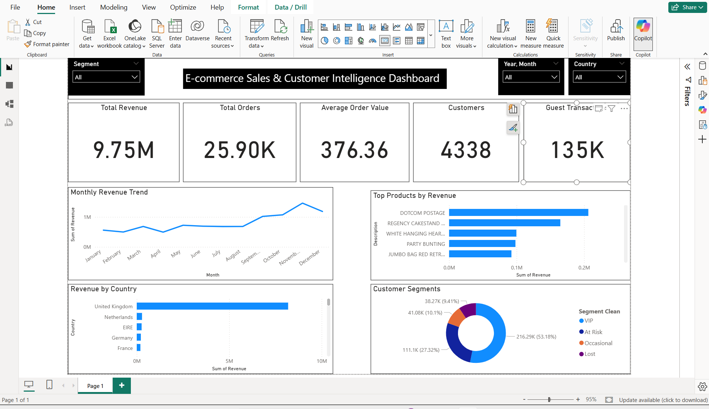

# E-commerce Sales & Customer Intelligence Dashboard


## Overview

An end-to-end business intelligence project analysing 541,909 transactions from a UK-based online retailer. The goal was to answer one core business question:

> **Where is revenue coming from — and who is at risk of leaving?**

Using Python for data cleaning and RFM-based customer segmentation, and Power BI for interactive reporting, this dashboard gives a business owner complete visibility into revenue performance, product concentration, geographic risk, and customer retention gaps.

---

## Business Problem

The business had no centralised view of its sales performance. Without visibility, it could not answer:

- Which products and markets drive the most revenue?
- Are sales growing or declining month on month?
- Which customers are loyal, at risk, or already lost?
- Where should marketing budget be focused?

This dashboard answers all four questions in a single page.

---

## Key Findings

| Finding | Insight | Recommendation |
|---|---|---|
| UK = 90%+ of revenue | Dangerous geographic concentration | Invest in Netherlands, Germany, EIRE — already buying |
| Nov–Dec revenue spike | 60% of annual revenue in 2 months | Build Q4 campaigns early, diversify across quarters |
| Top 5 products drive majority of sales | Product concentration risk | Expand catalogue around proven bestsellers |
| 53% of customers are Lost | Majority of base has stopped buying | Launch win-back email campaign immediately |
| 27% of customers are At Risk | About to churn right now | Trigger retention offer before they leave |
| Only 16% are VIP | Highest value segment — £8,074 avg spend | Protect this group with loyalty programme |
| Guest transactions = real revenue gap | Unidentified buyers cannot be retained | Introduce mandatory account creation at checkout |

---

## Dashboard



### KPI Cards
| Metric | Value | What It Means |
|---|---|---|
| Total Revenue | £9.75M | Full transaction revenue including guest checkouts |
| Total Orders | 25.90K | Distinct invoices — confirms wholesale buyer behaviour |
| Average Order Value | £376.36 | High AOV confirms B2B / bulk purchasing pattern |
| Unique Customers | 4,338 | Identified buyers only — excludes guest transactions |

### Visuals
- **Monthly Revenue Trend** — flat Jan–Oct, sharp Q4 spike reveals seasonal dependency
- **Top Products by Revenue** — top 5 products dominate; DOTCOM POSTAGE flags a data quality note
- **Revenue by Country** — UK dominance confirmed; 5 other markets present but underdeveloped
- **Customer Segments** — donut showing VIP / At Risk / Occasional / Lost split across 4,338 customers

### Slicers
- **Segment** — filter all visuals by customer type (VIP, At Risk, Lost, Occasional)
- **Year / Month** — isolate any time period across the full dataset
- **Country** — drill into any single market and see all KPIs update

---

## Data

**Source:** [UCI Online Retail Dataset](https://www.kaggle.com/datasets/mashlyn/online-retail-ii-uci) via Kaggle

| Table | Rows | Description |
|---|---|---|
| OnlineRetail | 541,909 | Cleaned transaction data — invoices, products, quantities, prices, dates, countries |
| customer_segments_labelled | 4,338 | RFM-segmented customers with Cluster and Segment labels |

### Data Cleaning (Python / Pandas)
- Removed cancellations — invoices starting with "C"
- Removed rows with negative or zero Quantity and UnitPrice
- Added `Revenue` column — Quantity × UnitPrice

### Customer Segmentation (K-Means Clustering)
RFM analysis across 4,338 identified customers:

| Segment | Recency | Frequency | Avg Spend | Count |
|---|---|---|---|---|
| VIP | 12 days | 14 orders | £8,074 | 716 (16%) |
| Occasional | 18 days | 2 orders | £552 | 837 (19%) |
| At Risk | 71 days | 4 orders | £1,803 | 1,173 (27%) |
| Lost | 183 days | 1 order | £344 | 1,612 (37%) |

**Observation on Blank CustomerIDs:** 133,361 transaction rows have no CustomerID — these are guest or unregistered purchases. They are included in all revenue KPIs (real sales) but excluded from customer segmentation (no identity to segment). In a production environment, mandatory account creation at checkout would convert these into trackable customers.

---

## Tools & Stack

| Tool | Purpose |
|---|---|
| Python (Pandas) | Data cleaning, Revenue column, export to CSV |
| Jupyter Notebook | Exploratory analysis and segmentation pipeline |
| Scikit-learn (K-Means) | RFM clustering into 4 customer segments |
| Power BI Desktop | Dashboard, DAX measures, interactive slicers |

### DAX Measures
```dax
Total Revenue = SUM(OnlineRetail[Revenue])
Total Orders = DISTINCTCOUNT(OnlineRetail[InvoiceNo])
AOV = DIVIDE([Total Revenue], [Total Orders])
Unique Customers = DISTINCTCOUNT(customer_segments_labelled[CustomerID])
Guest Transactions = CALCULATE(COUNTROWS(OnlineRetail), ISBLANK(OnlineRetail[CustomerID]))
```

---

## Files

```
├── online-retail-fixed.ipynb           # Data cleaning and export notebook
├── customer-segmentation-kmeans.ipynb  # RFM segmentation notebook
├── online_retail_clean.csv             # Cleaned transaction data
├── customer_segments_labelled.csv      # Segmented customer data
├── Ecommerce_Solution1.pbix            # Power BI dashboard file
├── dashboard.png                       # Dashboard screenshot
└── README.md                           # This file
```

---

## How to Run

1. Download [UCI Online Retail Dataset](https://www.kaggle.com/datasets/mashlyn/online-retail-ii-uci) from Kaggle
2. Place `online_retail_II.csv` in the same folder as the notebooks
3. Run `online-retail-fixed.ipynb` to produce `online_retail_clean.csv`
4. Run `customer-segmentation-kmeans.ipynb` to produce `customer_segments_labelled.csv`
5. Open `Ecommerce_Solution1.pbix` in Power BI Desktop
6. Refresh data sources pointing to your local CSV files

---

## Business Recommendations

Based on the analysis, the three highest ROI actions for this business are:

**1. Protect VIP customers immediately**
716 customers generate £8,074 average spend — 23x more than lost customers. A loyalty programme or dedicated account manager for this group pays for itself instantly. (It very important to create this marketing program and influence this customers to buy more from us)

**2. Launch a win-back campaign for At Risk segment**
1,173 customers have not purchased in 71 days but previously bought 4 times. They are worth recovering. A targeted discount or product recommendation email sent now will convert a portion back to active buyers. (A general email must be sent to increase our revenue and ensure increase in business value)

**3. Invest in international markets**
Netherlands, EIRE, Germany and France are already buying. They just have not been marketed to. Localised campaigns in these markets could double revenue without acquiring a single new product.

---

## Author

Built as part of a data analytics portfolio project demonstrating end-to-end business intelligence — from raw data to actionable client insights.

